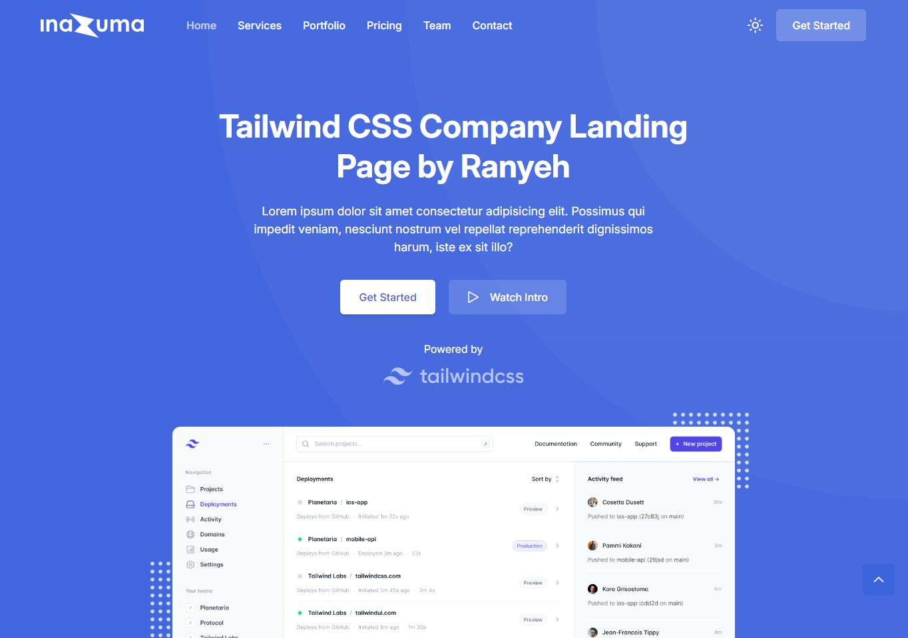

# Inazuma - Tailwind CSS Company Landing Page



This is a responsive landing page template for a company built with Tailwind CSS. It comes with a refreshing design, fully customizable and all essential elements that needed to launch a complete website. This project is created to practice and improve my Tailwind CSS skill.

## Description

Inazuma Tailwind CSS is an open-source and free Tailwind CSS template created by [Ranyeh](https://github.com/ranyeh24). Crafted for company website and can be used with almost all sort of web project. This template is Tailwind CSS version of [Inazuma](https://github.com/ranyeh24/inazuma) template with more refreshing design in it.

## Features

* Responsive navbar with CTA and dark mode buttons
* Hero section with CTA and intro video buttons
* Contains animations when scrolling
* Smooth scrolling in each section
* Includes a dark & light theme mode
* Responsive footer
* SEO-Friendly
* Compatible to all browsers

## Technologies Used

* HTML
* CSS
* JavaScript
* [Tailwind CSS](https://tailwindcss.com/)

## Plugins Used

* [ScrollReveal](https://scrollrevealjs.org/)
* [GLightbox](https://biati-digital.github.io/glightbox/)
* [Lineicons](https://lineicons.com/)

## Live Demo

You can see the live demo [here](https://ranyeh24.github.io/inazuma-tailwind).

## Installation

1. Clone the repository:
```
git clone https://github.com/yourusername/inazuma-tailwind.git
```
2. Or you can download and extract it to your project folder.
3. Open `index.html` in your web browser.

## Usage

This project is a static website. You can use it as a template or reference for building similar landing pages or to practice your Tailwind CSS skill.

## Customization

If you're new to Tailwind CSS, you have to learn it before doing customization. You can learn it [here](https://tailwindcss.com/docs/installation).

### Change Colors

1. Open the `tailwind.config.js` file.
2. Go to the `colors` key in the `extend` section under `theme` section.
```javascript
/** @type {import('tailwindcss').Config} */
module.exports = {
  ...
  theme: {
    extend: {
      ...
      colors: {
        // Colors customization here
        // If you want to change key name, make sure you change the class name that used in the HTML file
      },
      ...
    },
  },
  ...
};
```
3. Change the color keys or values you want. To learn more, see the [color customization documentation](https://tailwindcss.com/docs/colors).
4. Save the changes and run it in your web browser.

### Change Font Family

1. Open the `tailwind.config.js` file.
2. Go to the `fontFamily` key in the `extend` section under `theme` section.
```javascript
/** @type {import('tailwindcss').Config} */
module.exports = {
  ...
  theme: {
    extend: {
      ...
      fontFamily: {
        sans: ["Inter", "sans-serif"],  //Sans-serif font
      },
      ...
    },
  },
  ...
};
```
3. Replace `Inter` font name with another font name you want. To learn more, see the [font family customization documentation](https://tailwindcss.com/docs/font-family).
4. Open the `tailwind.css` file.
5. Update the Google Fonts link and change `font-family` property with the font name you want.
```css
@import url(/* Your Google Fonts link here */);
...
@layer base {
  ...
  html {
    ...
    font-family: /* Your font name here */;
  }
  ...
}
```
6. Save the changes and run it in your web browser.

## Bugs and Issues

Have a bug or an issue with this template? [Open a new issue](https://github.com/ranyeh24/inazuma/issues) here on GitHub or email me at <real.ranyeh24@gmail.com>.

## Credits

* Template design from [Play | Free Tailwind CSS Template for Startup and SaaS By TailGrids](https://play-tailwind.tailgrids.com/)
* Images from [Unsplash](https://unsplash.com/)

## License

Inazuma is open-source and available under the [MIT License](https://raw.githubusercontent.com/ranyeh24/inazuma/main/LICENSE). You can use it with your personal or commercial projects without any attribution or backlink.
